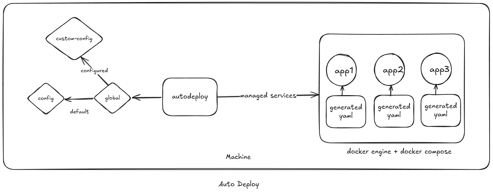

# Auto Deploy

Auto Deploy is a custom tool designed to accelerate development by serving as a wrapper around Git and Docker. It streamlines the deployment process in fast-paced environments by generating and managing configuration files dynamically.


# Why

Deploying applications locally before moving to cloud environments ensures smoother transitions and more effective testing. Auto Deploy simplifies this process by generating and managing essential configuration files, such as Docker Compose files, during runtime. This helps in configuring, testing, and deploying applications efficiently across different environments.

# Usage

## Authenication Files

You have to configure a `.env` file with the following variables

```.env
GIT_USERNAME="<USERNAME>"
GIT_PASSWORD="<PERSONAL-ACCESS-TOKEN / PASSWORD>"
```

## Configuration Files
the application expects the following configuration files
- `global.toml`
- `config.toml` (or any configuration file specified in `global.toml`)


contents of `global.toml`

```toml
banner = true                      # Enable/Disable banner at start
client = "Earth"                   # Optional
organization = "Avengers"          # Optional
configuration_file = "config.toml" # `config.toml` Default File
```

contents of `config.toml`
```toml
# DISCLAIMER:
# Optional configiration are required to be
# deleted before running the application

path = "./repos"

# --------- EXAMPLE ---------
[[application]]
name = "EXAMPLE"
# name of the directory where the repo will be cloned into
# $(pws)/repos/example
directory_name = "example"
url = "https://example.com"

[application.container]
name = "example"
image = "example"
restart_policy = "example"
ports = ["8080:8080", "9090:9090"]
volumes = [
    "xyz:zyx",
    "abc:cba",
] # optional For host path mapping use absolute paths
environment = ["KEY=VAL", "KEY=VAL"] # optional
standard_in = false # optional
interactive = false # optional
docker_user_group_id = "1000:1000" # optional

[application.container.build]
dockerfile = "Dockerfile"
build_args = ["KEY=VAL", "KEY=VAL"] # optional
```
## File Tree
repos will be cloned into the directory mentioned in `config.toml`
compose files will be generated in the working directory

```plaintext
working-directory/
│
├── autodeploy
├── .env
├── global.toml
├── config.toml
│
├── repos_folder/
│   ├── repo1/
│   │   └── ...
│   └── repo2/
│       └── ...
│
└── compose_files/
    └── compose_file-1.yaml
    └── compose_file-2.yaml
```

# How to Build

To build and run this Rust project, follow these steps:

### Prerequisites

1. **Clone the Repository:**
   First, clone the repository to your local machine:

     ```sh
    git clone https://github.com/theinhumaneme/autodeploy.git
    cd autodeploy
     ```
2. **Build the Project:**
   - Navigate to the project directory and run the following command to build the project:

     ```sh
     cargo build
     ```

   - This will compile the project and place the output in the `target/debug` directory. For a release build, you can use:

     ```sh
     cargo build --release
     ```

   - The release build output will be placed in the `target/release` directory.

### Running the Project

- To run the project after building, use the following command:

  ```sh
  cargo run
